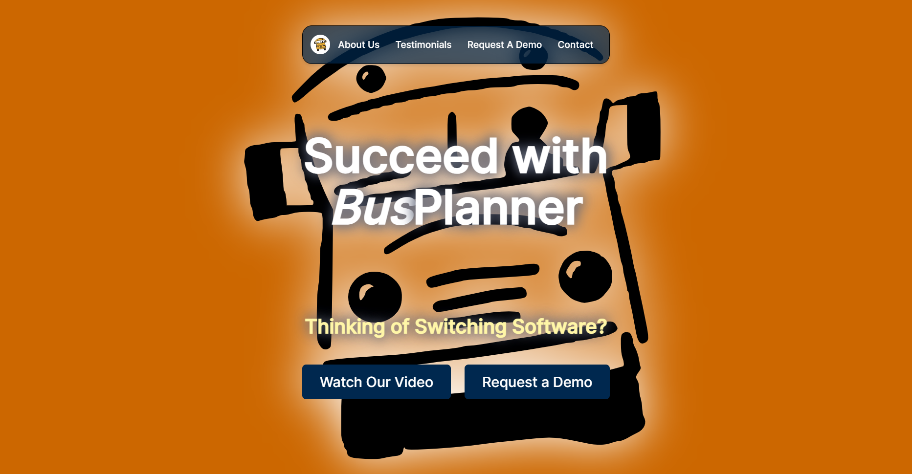

# BusPlanner Website Redesign Mockup 🚌

This repository contains a responsive website mockup for <a href="https://www.busplanner.com" target="_blank">busplanner.com</a>.

## Design Concept 💫
The mockup features a clean and minimalist design with a focus on user-friendly navigation, intuitive layout, and engaging visual elements.

## Process 💭
- The goals for this redesign were simple. Due to time limits, the focus was to create a single landing page for <a href="https://www.busplanner.com" target="_blank">busplanner.com</a>, which links to the existing pages. 
- No changes to the existing wording were made. The images were also sourced from the original page, and converted to SVG for this project.
- A good chunk of my time was spent on choosing the color that ensures a good contrast. I also referred to <a href="https://color.adobe.com/create/color-wheel" target="_blank">Adobe Color Wheel</a> when making this decision.
- Majority of my time was also spent on responsive design for various screen sizes. Took me awhile to resolve the issue where the logo in the background looked awkward when resizing the window. The culprit was the (background image) background-size attribute for the body in index.scss.
- Given more time, other features that could have been included are:
  - A responsive navbar.
  - Redesign of the other pages.
  - Possibly more refactoring in the Sass files.
- Other than that, a bit of time was dedicated to this README, and deployment of this project to a live link.

## Technology Stack 🔧
- <a href="https://react.dev/" target="_blank">ReactJS</a> (this project is built with <a href="https://vitejs.dev/guide/" target="_blank">Vite</a>)
- <a href="https://sass-lang.com/documentation/" target="_blank">Sass</a> Styling
- <a href="https://mui.com/material-ui/getting-started/installation/" target="_blank">MUI Library</a> - this was only used for the Github link component.

## Sources 🪝
- <a href="https://www.busplanner.com" target="_blank">BusPlanner</a> Website - Images were downloaded from here
- <a href="https://picsvg.com/" target="_blank">Picsvg</a> - JPEG to SVG converter

 

